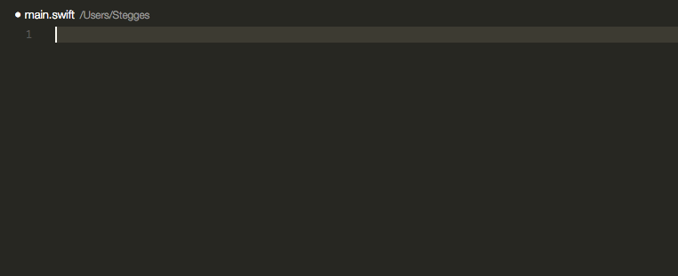

# Emoji

A simple plugin to insert emoji from the command palette.

## Installation

Run ``ext install emoji`` in the command palette.

## Usage

Run ``Emoji: Insert emoji`` or ``Emoji: Insert emoji unicode`` in the command palette and select the emoji to insert at the cursor.

